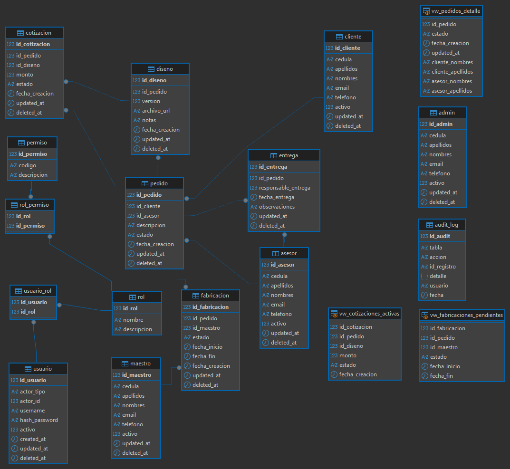

# Proyecto Taller de Joyería – Modelo de Datos y Base de Datos

## Modelos y Documentación del Software / Base de Datos

### Docente
Ing. Hely Suarez Marín

### Integrantes
- Nick Alejandro Ortega Méndez  
- Santiago Alejandro Medina Ortega  
- Johel Alexander Velasco Guerrero  

27 / Noviembre / 2025

---

## 1. Problema

Los talleres de joyería artesanal suelen manejar su información de forma manual o en múltiples canales dispersos (libretas, chats, mensajes de voz, etc.).  
Cuando aumentan los pedidos personalizados, también crece la dificultad para:

- Registrar correctamente los datos del cliente y sus requerimientos.
- Versionar diseños y bocetos de las piezas.
- Controlar estados de cotización, aprobación, fabricación y entrega.
- Saber quién hizo qué y en qué momento (trazabilidad).

La falta de una base de datos estructurada provoca pérdida de información, duplicidad de registros, errores de comunicación entre asesores y maestros joyeros y poca visibilidad del estado real de los pedidos.

---

## 2. Solución propuesta (modelo de datos)

Para resolver este problema se diseñó e implementó una base de datos en **MySQL 8** llamada **`jewelry_workshop`**, que soporta el ciclo completo del negocio:

1. Registro de actores (cliente, asesor, maestro, admin).
2. Creación y seguimiento de pedidos.
3. Gestión de diseños y cotizaciones.
4. Control del proceso de fabricación.
5. Registro formal de la entrega.
6. Seguridad por usuarios, roles y permisos.
7. Auditoría automática de cambios (triggers y bitácora).

La BD incluye restricciones `CHECK`, llaves foráneas, vistas y un procedimiento almacenado para mantener la integridad y la trazabilidad de la información.

---

## 3. Impacto esperado del modelo

1. **Control y trazabilidad de la información**  
   Cada pedido, diseño, cotización, fabricación y entrega queda asociado a un cliente, a un asesor y a un maestro específico, permitiendo reconstruir fácilmente el historial.

2. **Apoyo a la seguridad y auditoría**  
   El esquema de usuarios, roles y permisos, sumado a la tabla `audit_log` y a los triggers, permite saber qué operaciones se realizaron sobre pedidos y cotizaciones, y por qué usuario.

3. **Base sólida para la aplicación web**  
   El modelo de datos está preparado para que la futura aplicación (por ejemplo, en Laravel) pueda consumir la información mediante vistas e implementar reglas de negocio encima de una estructura consistente.

---

## 4. Descripción general del proceso

### 4.1. Flujo del proceso de negocio

El flujo inicia con la **solicitud del cliente**, donde el asesor registra un **pedido** con la descripción de la joya a fabricar.  
Luego se crean uno o varios **diseños** asociados al pedido y se genera una **cotización** con su valor y estado.

Si el cliente aprueba la cotización, el pedido pasa a **fabricación**, a cargo de un maestro joyero. Finalizada la pieza, se realiza un **control de calidad** y, finalmente, se registra la **entrega** al cliente.  
En todo momento se mantienen los estados del pedido y la fabricación, además de registrar quién hizo cada acción.

---

## 5. Modelo de datos (ER)

### 5.1. Diagrama ER de la base de datos

En el diagrama ER se identifican cuatro grupos principales:

1. **Actores**: `cliente`, `asesor`, `maestro`, `admin`.  
2. **Gestión de pedidos**: `pedido`, `diseno`, `cotizacion`, `fabricacion`, `entrega`.  
3. **Seguridad**: `usuario`, `rol`, `permiso`, `usuario_rol`, `rol_permiso`.  
4. **Soporte y monitoreo**: `audit_log`, vistas (`vw_cotizaciones_activas`, `vw_fabricaciones_pendientes`, `vw_pedidos_detalle`) y el procedimiento `sp_aprobar_cotizacion`.

---

## 6. Tablas principales del negocio

### 6.1. Tabla `cliente`

Registra los datos básicos del cliente:

- `id_cliente` (PK), `cedula`, `apellidos`, `nombres`, `email`, `telefono`.
- Campos `activo`, `updated_at`, `deleted_at` para manejo de estado lógico.
- Validaciones por `CHECK` para correo y teléfono.

Un cliente puede tener **varios pedidos**, pero cada pedido pertenece a un solo cliente.

---

### 6.2. Tabla `asesor`

Almacena la información del asesor o persona que atiende al cliente:

- Estructura similar a `cliente`.
- Aparece referenciada en:
  - `pedido.id_asesor` (asesor responsable del pedido).
  - `entrega.responsable_entrega` (quien entrega la pieza al cliente).

---

### 6.3. Tabla `maestro`

Representa al maestro joyero que se encarga de la fabricación:

- Registra sus datos personales y estado (`activo`).
- Se relaciona con `fabricacion.id_maestro` para asignar responsables por pieza.

---

### 6.4. Tabla `pedido`

Es la tabla central del modelo.

- Campos principales:
  - `id_pedido` (PK)
  - `id_cliente` (FK → `cliente`)
  - `id_asesor` (FK → `asesor`)
  - `descripcion` (detalle del trabajo)
  - `estado` (`Creado`, `Cotizado`, `Aprobado`, `Fabricacion`, `Entregado`, `Cancelado`)
  - `fecha_creacion`, `updated_at`, `deleted_at`
- Restricción `CHECK` para asegurar estados válidos.

**Triggers asociados:**

- `trg_pedido_ai`, `trg_pedido_au`, `trg_pedido_ad`:  
  Insertan registros en `audit_log` cada vez que se crea, actualiza o elimina un pedido, guardando información como estado anterior/nuevo y usuario del sistema.

---

### 6.5. Tabla `diseno`

Tabla de versiones de diseño ligadas a un pedido:

- `id_diseno` (PK), `id_pedido` (FK), `version`, `archivo_url`, `notas`, `fecha_creacion`, `updated_at`, `deleted_at`.
- Un mismo pedido puede tener **varias versiones** de diseño, permitiendo iterar con el cliente.

---

### 6.6. Tabla `cotizacion`

Registra las cotizaciones económicas:

- `id_cotizacion` (PK)
- `id_pedido` (FK → `pedido`)
- `id_diseno` (FK → `diseno`)
- `monto` (con `CHECK` > 0)
- `estado` (`Enviada`, `Aprobada`, `Rechazada`)
- `fecha_creacion`, `updated_at`, `deleted_at`

**Triggers:**

- `trg_cotizacion_ai` y `trg_cotizacion_au` registran inserciones y actualizaciones en `audit_log`, incluyendo cambios de estado y montos.

---

### 6.7. Tabla `fabricacion`

Control de fabricación:

- `id_fabricacion` (PK)
- `id_pedido` (FK → `pedido`)
- `id_maestro` (FK → `maestro`)
- `estado` (`Planificado`, `En Proceso`, `Terminado`)
- `fecha_inicio`, `fecha_fin` (con `CHECK` que garantiza que `fecha_fin >= fecha_inicio`)
- `fecha_creacion`, `updated_at`, `deleted_at`

Permite saber qué maestro tiene cada pedido y en qué etapa se encuentra la pieza.

---

### 6.8. Tabla `entrega`

Registra la entrega final al cliente:

- `id_entrega` (PK)
- `id_pedido` (FK → `pedido`)
- `responsable_entrega` (FK → `asesor`)
- `fecha_entrega`, `observaciones`, `updated_at`, `deleted_at`.

Con esta tabla se cierra el ciclo del pedido y queda registrada la persona que realizó la entrega.

---

## 7. Seguridad y auditoría

### 7.1. Tablas `usuario`, `rol`, `permiso`, `usuario_rol`, `rol_permiso`

- `usuario`: conecta un actor (`admin`, `asesor`, `maestro` o `cliente`) con una cuenta de acceso (`username`, `hash_password`).
- `rol`: define perfiles generales (`admin`, `asesor`, `maestro`, `cliente`).
- `permiso`: agrupa permisos atómicos (`pedido.leer`, `pedido.escribir`, `cotizacion.gestionar`, etc.).
- `rol_permiso`: relación muchos-a-muchos entre roles y permisos.
- `usuario_rol`: relación muchos-a-muchos entre usuarios y roles.

Este esquema soporta un control de accesos flexible y alineado con los módulos de la aplicación.

---

### 7.2. Tabla `audit_log`

Bitácora de auditoría que concentra las operaciones relevantes:

- `id_audit`, `tabla`, `accion` (`INSERT`, `UPDATE`, `DELETE`), `id_registro`, `detalle` (JSON), `usuario`, `fecha`.

Se alimenta desde los triggers de `pedido`, `cotizacion` y desde el procedimiento `sp_aprobar_cotizacion`, permitiendo rastrear cambios críticos.

---

### 7.3. Procedimiento `sp_aprobar_cotizacion`

Procedimiento almacenado que encapsula la lógica de aprobación de cotizaciones:

1. Recibe el `p_id_cotizacion`.
2. Obtiene el `id_pedido` asociado.
3. Dentro de una transacción:
   - Actualiza `cotizacion.estado` a `'Aprobada'`.
   - Actualiza `pedido.estado` a `'Aprobado'`.
   - Registra ambos cambios en `audit_log`.

De esta manera se garantiza que cotización y pedido se mantengan sincronizados y que el proceso quede auditado.

---

### 7.4. Vistas de consulta

- **`vw_cotizaciones_activas`**:  
  Lista cotizaciones cuyo estado es `Enviada` o `Aprobada`.

- **`vw_fabricaciones_pendientes`**:  
  Muestra fabricaciones con estado diferente de `Terminado`, ideal para paneles de trabajo pendiente.

- **`vw_pedidos_detalle`**:  
  Une `pedido`, `cliente` y `asesor` para mostrar un resumen amigable (nombres, apellidos, estado y fechas del pedido).

---

## 8. Relación con los diagramas UML

Aunque la documentación UML se detalla en un archivo aparte, el modelo de datos se apoya principalmente en:

- **Diagrama de Casos de Uso** (`../../assets/Diagramas/casos_de_uso.png`), que definió actores y funcionalidades.
- **Diagrama de Actividades** (`../../assets/Diagramas/actividades.png`), que inspiró la secuencia de tablas y estados.
- **Diagrama de Clases** (`../../assets/Diagramas/clases.png`), que se convirtió casi directamente en las tablas actuales.
- **Diagrama de Estados** (`../../assets/Diagramas/estados.png`), que se refleja en los campos `estado` de `pedido` y `fabricacion`.

---

## 9. Conclusión

La base de datos **`jewelry_workshop`** no solo almacena datos, sino que refleja el flujo real del taller de joyería, con sus actores, procesos y reglas de negocio.

Gracias a:

- Su modelo normalizado y con restricciones,
- El esquema de seguridad por roles y permisos,
- Y la auditoría integrada,

se convierte en una base sólida para la aplicación web y en un insumo clave para análisis, reportes y futuras mejoras del sistema.
