# Proyecto Taller de Joyería – Documentación UML

## Modelos y Documentación del Software

### Docente
Ing. Hely Suarez Marín

### Integrantes
- Nick Alejandro Ortega Méndez  
- Santiago Alejandro Medina Ortega  
- Johel Alexander Velasco Guerrero  

25 / Noviembre / 2025

---

## 1. Descripción general del proceso

El flujo principal del sistema inicia cuando el **cliente** realiza una solicitud de joya personalizada.  
El **asesor** registra el pedido, adjunta diseños y genera una cotización. El cliente decide aprobar o rechazar la propuesta; si se aprueba, el pedido avanza a **fabricación** a cargo del **maestro joyero**.  
Después de la fabricación, la pieza pasa por **control de calidad** y finalmente se registra la **entrega**, cerrando el ciclo.

Este flujo es la base sobre la cual se construyeron todos los diagramas UML.

---

## 2. Diagrama de Casos de Uso

El diagrama de casos de uso muestra las acciones principales que pueden realizar los actores dentro del sistema:

- **Cliente**  
  - Revisa y aprueba/rechaza cotizaciones.  
  - Consulta el estado de sus pedidos.

- **Asesor**  
  - Registra nuevos pedidos.  
  - Adjunta diseños.  
  - Genera y actualiza cotizaciones.  
  - Coordina la fabricación y la entrega al cliente.

- **Maestro joyero**  
  - Recibe los pedidos aprobados.  
  - Realiza la fabricación de la joya.  
  - Actualiza el estado de su trabajo.

- **Administrador**  
  - Gestiona usuarios, roles y permisos.  
  - Administra catálogos y parámetros del sistema.

Este diagrama define el **alcance funcional** del sistema y guió la identificación de las entidades principales en la base de datos.

---

## 3. Diagrama de Actividades

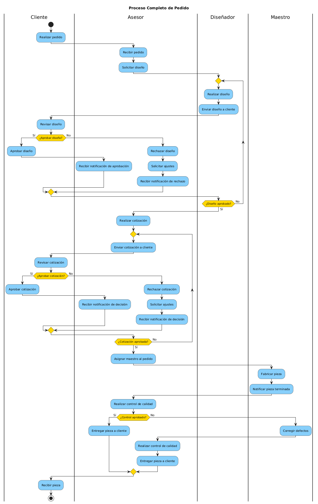

El diagrama de actividades describe paso a paso el flujo de un pedido:

1. El cliente solicita la joya (inicio del proceso).
2. El asesor registra el pedido y adjunta el diseño.
3. Se genera la cotización.
4. El cliente revisa y toma una decisión:
   - Si **rechaza**, se puede ajustar diseño o precio y volver a cotizar.
   - Si **aprueba**, el pedido pasa a fabricación.
5. El maestro joyero fabrica la pieza.
6. Se realiza el control de calidad.
7. Se registra la entrega al cliente y se cierra el proceso.

Este diagrama ayuda a identificar las **tareas, decisiones y posibles caminos alternos**, y se relaciona directamente con los estados de las tablas `pedido`, `cotizacion` y `fabricacion`.

---

## 4. Diagrama de Secuencia

### 4.1. Secuencia: Aprobación de Cotización

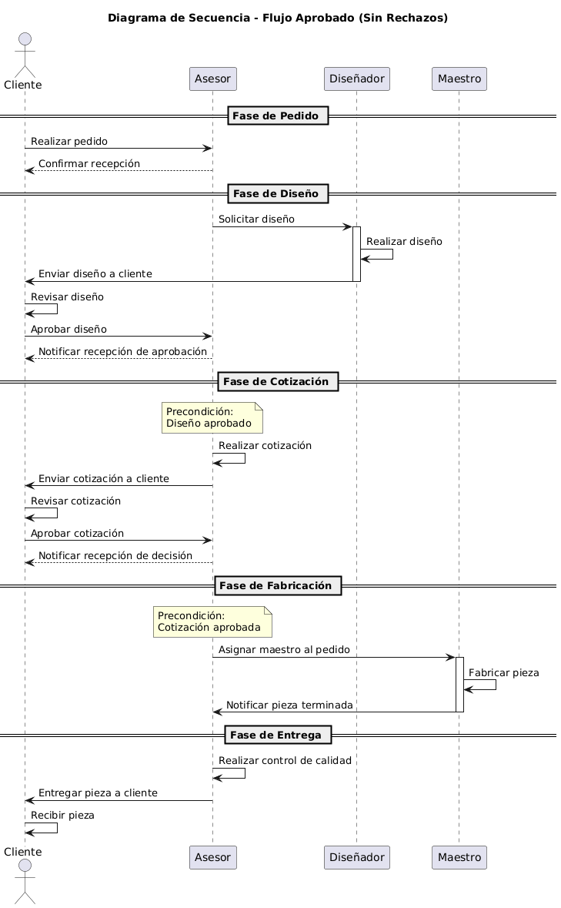

Muestra el intercambio de mensajes entre:

- Cliente  
- Interfaz de usuario  
- Servicio o controlador de cotizaciones  
- Procedimiento `sp_aprobar_cotizacion`  
- Tablas `cotizacion`, `pedido` y `audit_log`

Flujo resumido:

1. El cliente indica al asesor que aprueba la cotización.
2. La interfaz envía la acción al sistema.
3. El sistema ejecuta el procedimiento almacenado, que:
   - Cambia el estado de la cotización a `Aprobada`.  
   - Actualiza el estado del pedido a `Aprobado`.  
   - Escribe los cambios en la tabla `audit_log`.
4. La interfaz muestra el nuevo estado al usuario.

### 4.2. Secuencia: Rechazo de Cotización

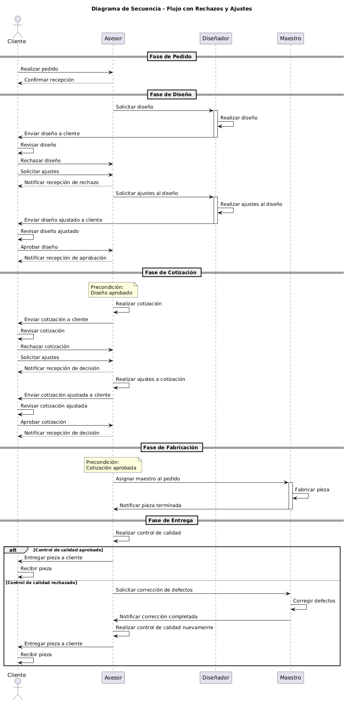

Cuando el cliente **rechaza** la cotización:

1. La interfaz registra la decisión.
2. El sistema cambia el estado de la cotización a `Rechazada`.
3. Se registra el cambio en `audit_log`.
4. El asesor puede ajustar el diseño o el precio y enviar una nueva cotización.

Estos diagramas de secuencia permiten visualizar el orden de las operaciones y qué componentes participan en cada acción.

---

## 5. Diagrama de Clases

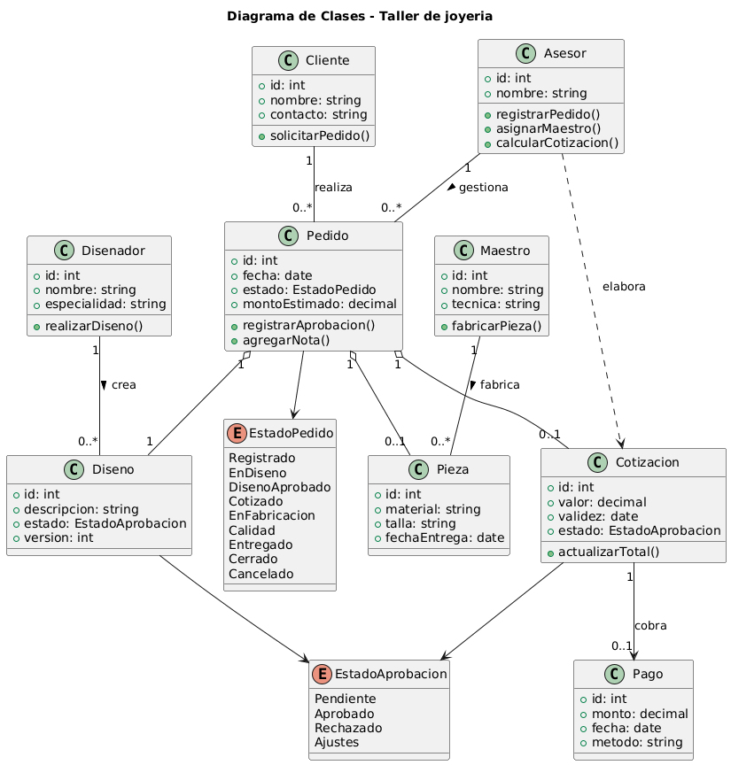

El diagrama de clases modela las entidades del dominio:

- **Clases relacionadas con personas**:  
  `Cliente`, `Asesor`, `Maestro`, `Admin`.

- **Clases de negocio**:  
  `Pedido`, `Diseno`, `Cotizacion`, `Fabricacion`, `Entrega`.

- **Clases de seguridad**:  
  `Usuario`, `Rol`, `Permiso`, `UsuarioRol`, `RolPermiso`.

Cada clase incluye atributos que luego se reflejan en la base de datos.  
Las asociaciones (1..*, *..*) y composiciones sirvieron para decidir qué relaciones se implementan mediante llaves foráneas y qué elementos se convierten en tablas intermedias.

---

## 6. Diagrama de Objetos

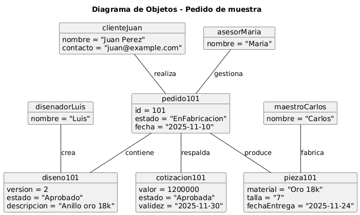

El diagrama de objetos presenta **instancias concretas** de las clases, por ejemplo:

- Un cliente específico con su nombre y contacto.
- Un pedido concreto con su descripción.
- La cotización asociada, su valor y estado.
- La fabricación correspondiente con fechas reales.
- La entrega final al cliente.

Sirve para visualizar cómo el modelo se ve “poblado” con datos reales y ayuda a comprobar que las relaciones entre entidades son coherentes.

---

## 7. Diagrama de Estados

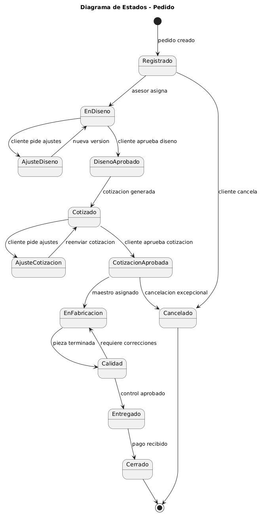

Modela el ciclo de vida de un pedido dentro del sistema:

1. **Creado**  
2. **Cotizado**  
3. **Aprobado** o **Cancelado**  
4. **Fabricacion**  
5. **Entregado**

Cada transición se relaciona con acciones en la base de datos:

- Cambios en `pedido.estado` y `fabricacion.estado`.
- Registros en `audit_log` para mantener trazabilidad.

Este diagrama garantiza que el flujo de estados sea coherente con las reglas del negocio.

---

## 8. Diagrama de Tiempo

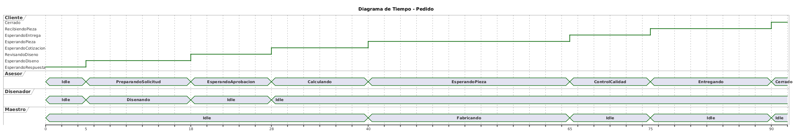

El diagrama de tiempo muestra la evolución de los participantes a lo largo del proceso:

- El cliente desde la solicitud hasta la recepción de la joya.
- El asesor desde el registro del pedido hasta la entrega.
- El maestro desde el inicio hasta el fin de la fabricación.
- El sistema gestionando notificaciones, estados y auditoría.

Ayuda a justificar campos como `fecha_creacion`, `fecha_inicio`, `fecha_fin`, `fecha_entrega` y `updated_at` que se encuentran en las tablas.

---

## 9. Diagrama de Paquetes

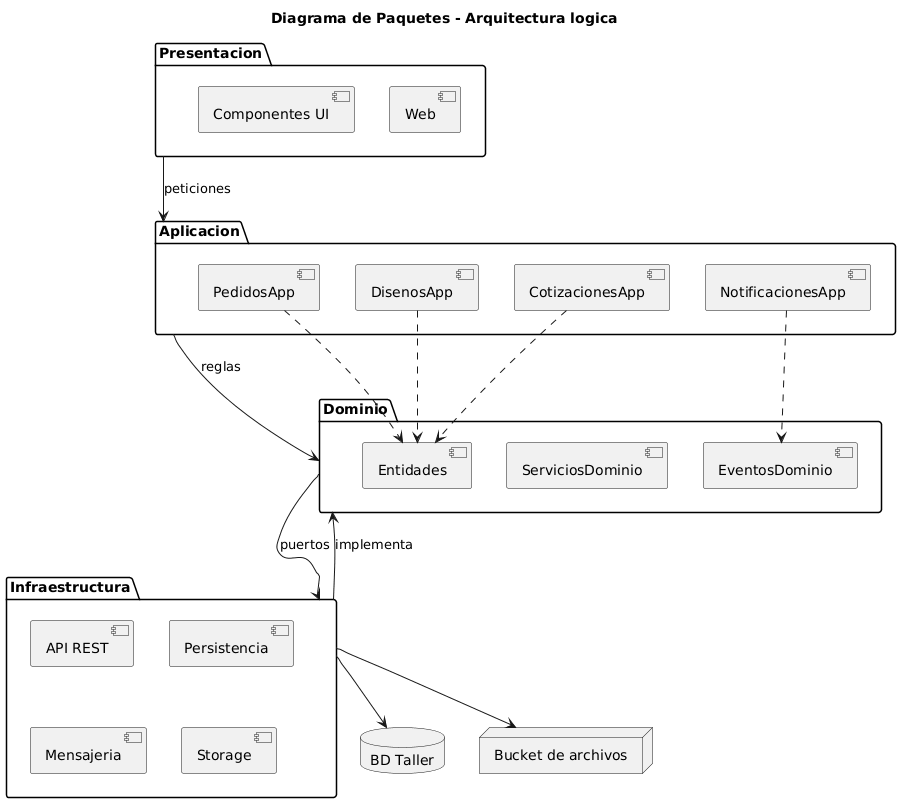

Organiza el sistema en módulos lógicos, por ejemplo:

- **Presentación**: vistas e interfaces para cada actor.
- **Lógica de Negocio**: manejo de pedidos, cotizaciones, diseño, fabricación y entrega.
- **Seguridad**: autenticación, roles y permisos.
- **Datos**: acceso a la base `jewelry_workshop`.

Este diagrama ayuda a pensar la arquitectura del software de forma modular, facilitando mantenimiento y escalabilidad.

---

## 10. Diagrama de Componentes

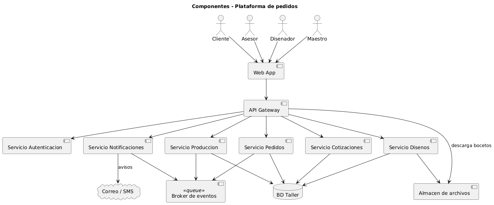

Representa componentes como:

- **Web UI / Frontend**
- **API / Backend**
- **Módulos de negocio** (pedidos, cotizaciones, fabricación, entregas)
- **Módulo de seguridad y auditoría**
- **Base de datos MySQL**

Describe cómo cada componente se comunica con los demás y qué responsabilidades tiene dentro de la solución.

---

## 11. Diagrama de Comunicación

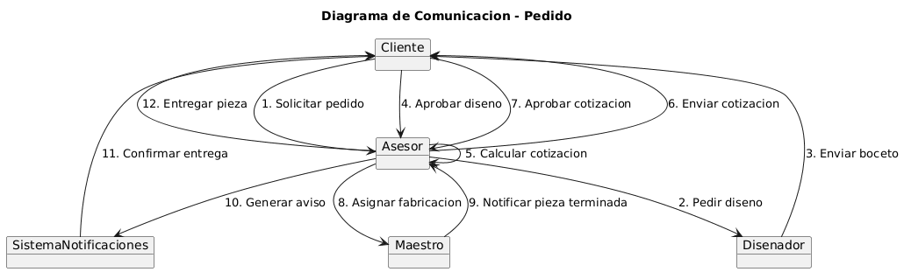

Detalla el intercambio de mensajes entre objetos o componentes para distintos escenarios del sistema, reforzando lo visto en los diagramas de secuencia:

- Mensajes para registrar pedidos.
- Mensajes para aprobar/rechazar cotizaciones.
- Mensajes para actualizar estados de fabricación.
- Mensajes para registrar entregas.

---

## 12. Diagrama de Instalación

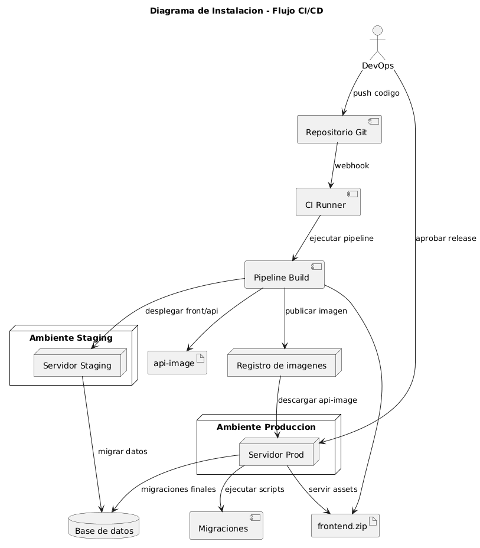

Muestra cómo se distribuye físicamente el sistema:

- Navegadores de clientes, asesores y administradores.
- Servidor de aplicaciones (por ejemplo, Laravel).
- Servidor de base de datos MySQL con el esquema `jewelry_workshop`.

Este diagrama sirve como referencia para el despliegue real en un entorno de producción o pruebas.

---

## 13. Diagrama de Despliegue

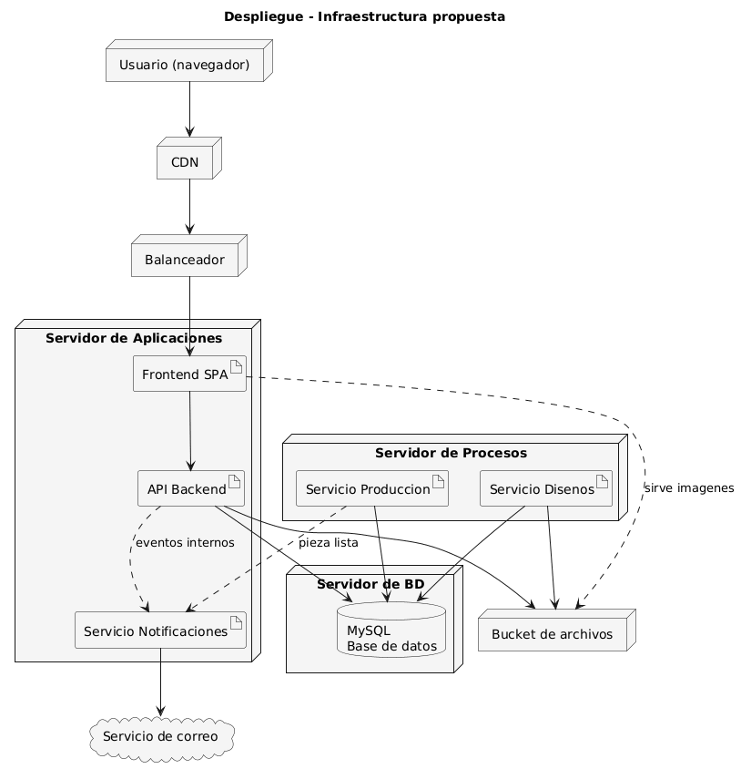

Refuerza la vista física e indica:

- Nodos (cliente, servidor web, servidor de BD).
- Conexiones entre ellos.
- Componentes desplegados en cada nodo.

Ayuda a explicar cómo se orquesta el sistema desde el punto de vista de infraestructura.

---

## 14. Conclusión

El conjunto de diagramas UML:

- Describe **qué hace** el sistema (casos de uso).
- Explica **cómo funciona** internamente (actividades, secuencias, estados, tiempo, comunicación).
- Muestra **cómo está organizado** el código y la infraestructura (clases, paquetes, componentes, instalación y despliegue).
- Mantiene una alineación directa con la base de datos `jewelry_workshop`, lo que facilita la sustentación del proyecto y futuras extensiones.

En conjunto, sirven como documentación completa del sistema de taller de joyería, tanto desde la perspectiva de negocio como técnica.
